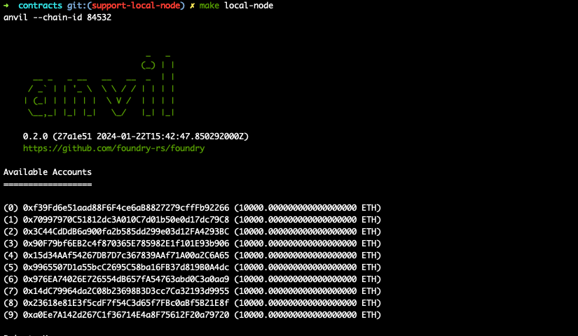

## Contracts

This project is built using Foundry. For more information, visit the docs [here](https://book.getfoundry.sh/)

# Disclaimer

The provided Solidity contracts are intended solely for educational purposes and are
not warranted for any specific use. They have not been audited and may contain vulnerabilities, hence should
not be deployed in production environments. Users are advised to seek professional review and conduct a
comprehensive security audit before any real-world application to mitigate risks of financial loss or other
consequences. The author(s) disclaim all liability for any damages arising from the use of these contracts.
Use at your own risk, acknowledging the inherent risks of smart contract technology on the blockchain.


## Usage

### Installation

Install foundry using

```shell
curl -L https://foundry.paradigm.xyz | bash
foundryup
```

Follow the instructions of foundryup to completely setup foundry

### Install dependencies

```shell
forge install
```

### Build

```shell
forge build
```

### Test

```shell
forge test
```

### Coverage

You will need to install [genhtml](https://github.com/linux-test-project/lcov) to generate html reports (`brew install lcov` for osx).

```shell
forge coverage --report lcov && genhtml -o report --branch-coverage lcov.info
```

### Format

```shell
forge fmt
```

### Deploy and verify contracts on Base Sepolia

Open `.env` file.

`PRIVATE_KEY` is your private wallet key. Make sure to prefix it by "0x" to convert to a hex string.

`BLOCK_EXPLORER_API_KEY` is your API Key from [basescan.org](https://docs.basescan.org/getting-started) for Base Sepolia

```bash
source .env

forge script script/D00DeployToken.s.sol --private-key $PRIVATE_KEY --broadcast --verify --rpc-url base_sepolia
forge script script/D01DeployTracker.s.sol --private-key $PRIVATE_KEY --broadcast --verify --rpc-url base_sepolia
```

<b> Note: The above command will print the address of your contract and a link to the block explorer. Click on the block explorer link to verify whether your contract has been deployed or not </b>


Forge runs your solidity script. In that script it tries to broadcast the transaction. It writes it back into the broadcast folder in a `run-latest.json` file.

### Add A New Challenge

[Notice] Please adjust the parameters accordingly.

```bash
cast send 0x7D1981603530aa76db92186DA40092c5394B7635 "create((address,uint64,uint64,uint64,uint64,address,address,address,uint128,uint128))" "(0x29C3d6b54E2F8Ae641Fc331cF2143B6
d05c97897,2,1722470400,1723708801,1723708802,0x29C3d6b54E2F8Ae641Fc331cF2143B6d05c97897,0x0000000000000000000000000000000000000000,0xCb5c7C676D8CcE531ceDd0fe2b4159b59607910F,5000,1000000)" --private-key $PRIVATE_KEY --rpc-url base_sepolia
```

### Settle A Challenge

[Notice] Please adjust the parameters accordingly.

```bash
cast send 0x7D1981603530aa76db92186DA40092c5394B7635 "settle(uint256)" "9" --private-key $PRIVATE_KEY --rpc-url base_sepolia
```

### Enabled Donation Org Address

[Notice] Please adjust the parameters accordingly.

```bash
cast send 0x7D1981603530aa76db92186DA40092c5394B7635 "setDonationOrgEnabled(address,bool)" "0x29C3d6b54E2F8Ae641Fc331cF2143B6d05c97897" "true" --private-key $PRIVATE_KEY --rpc-url base_sepolia
```

### ABI

To extract the `abi` of your contract, you can go to `out/BuyMeACoffee.sol/BuyMeACoffee.json` and copy the value corresponding to the `abi` key

## Deploying your own contract

1. To deploy your own contract create a new `.sol` file inside the `contracts/src` folder, similar to `BuyMeACoffee.sol`
2. Format and build your contracts using `forge fmt` and `forge build` respectively.
3. Write some tests by creating a test file inside `contracts/test` folder, similar to `BuyMeACoffee.t.sol`. Run the test using `forge test`
4. Write a deployment script inside `contracts/script`, similar to `BuyMeACoffee.s.sol`
5. Create a `.env` file using the `.env.example` file provided in your contracts folder and add your private key. Make sure to add a `0x` in front of your key to convert it to a hex string.
6. Deploy your contract using the following commands:

   ```bash
   source .env

   forge script script/YOUR_SCRIPT.s.sol:YOUR_SCRIPT --broadcast --rpc-url base_sepolia
   ```

   Note: To deploy on a different network, simply add the specific RPC endpoint within the `[rpc_endpoints]` section found in the `foundry.toml` file.
   <br/>

7. To extract the `abi` of your contract, you can go to `out/YOUR_CONTRACT.sol/YOUR_CONTRACT.json` and copy the value corresponding to the `abi` key

## Deploy to local node

Initially, building on a local node can offer numerous benefits, including:

- The ability to add debug statements.
- The capability to fork a chain at a particular block, enabling the detection of reasons behind specific behaviors.
- The absence of the need for testnet/mainnet funds.
- Faster testing, as only your node is responsible for consensus.

You can deploy your contracts to local node for faster testing as follows:

```bash
make local-node
```



To deploy the contract:

- Make sure to delete the following lines from `foundry.toml` because locally we dont have a block explorer

  ```
  [etherscan]
  "${NETWORK}"={key="${BLOCK_EXPLORER_API_KEY}"}
  ```

- Create a `.env` file using the `.env.example` file provided in your contracts folder and add one the private keys printed on your terminal when you ran `make local-node`. Also update the `RPC_URL` to `http://127.0.0.1:8545`, this will make sure your contracts are deployed locally

- Deploy the sample contract using:
  ```
  source .env
  forge script script/LocalContract.s.sol:LocalContractScript  --broadcast --rpc-url ${RPC_URL}
  ```


You can observe that the console2 library facilitates the addition of console logs in the contract, which would not have been possible if you were deploying to a testnet or mainnet.

## Contributing

If you would like to contribute to contracts folder, follow the given steps for setup

### Installation

Install foundry using

```shell
curl -L https://foundry.paradigm.xyz | bash
foundryup
```

Follow the instructions of foundryup to completely setup foundry

### Install dependencies

Run the following commands inside the contracts folder:

```shell
forge install
forge build
```

You should be good to go :) Thank you for the support ❤️
